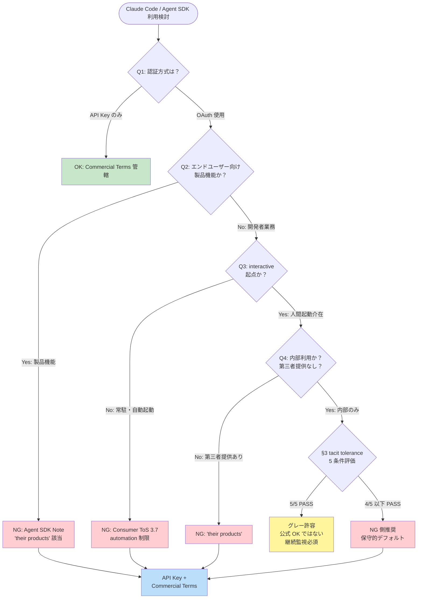

# Claude Code 利用境界ガイド

**作成日**: 2026-04-09
**作成者**: rosehip（cmd_167 v2 主調査担当）
**対象読者**: GuP-v2 内外のプロジェクトで Claude Code / Claude Max サブスクリプション利用可否を判断する必要がある開発者・意思決定者
**位置付け**: 意思決定フレームワーク。単なる事例集ではなく、「この場面ではこう判断する」という判断ロジックを提供する。
**参照ベース**:
- `projects/ai-novel-generator/docs/sections/03_tos_env_v2.md` (cmd_167 v2 主調査, 1007 行)
- `projects/ai-novel-generator/docs/sections/03_tos_env_v2_precedent.md` (cmd_167 v2 前例分析, hana, 570 行)

---

## 0. このガイドの使い方

### 0.1 対象範囲
- Claude Max / Pro サブスクリプションでの Claude Code / Agent SDK の利用判断
- 個人開発ツール、社内開発支援、製品実装のすべての局面
- ai-novel-generator 固有ではなく、**他プロジェクト・他チームでも参照可能な汎用ガイド**

### 0.2 保守的デフォルト（スタンス厳守）
- **「グレーなら NG 側に倒す」** のが本ガイドの基本姿勢
- Anthropic は我々が日常業務で依存しているパートナーであり、規約違反スレスレを狙うのではなく、**グレーゾーンを明確化して安全側で判断する**
- 「OK」と判定するには複数の独立した根拠が必要
- 「NG」と判定するには論理の抜けがないこと
- 迷った場合の既定値は「NG 扱い、API Key 移行」

### 0.3 時点限定性
- 本ガイドは **2026-04-09 時点** の Anthropic ポリシー解釈である
- Anthropic は 2026-02 / 2026-04-04 に複数回ポリシー改定・強制執行を実施しており、今後も変化する可能性が高い
- §5 の「継続監視事項」を定期的に確認すること

### 0.4 参照記法
- 本文中の **§X.X** 表記は `03_tos_env_v2.md` の章番号を指す
- **§P.X** 表記は `03_tos_env_v2_precedent.md` の章番号を指す

---

## 1. Anthropic が引いている線の仮説（3 軸）

cmd_167 v2 調査から導出された、Anthropic のポリシー境界線の仮説。公式に明文化されていない部分を含むため「仮説」と明示する。

### 1.1 第 1 軸: interactive vs non-interactive

| 区分 | 定義 | 境界の明確性 |
|---|---|---|
| **interactive** | 人間が 1 コマンドずつ手動起動し、人間ペースで操作する利用形態。`claude` CLI をターミナルで起動して対話する等。 | 比較的明確 |
| **non-interactive** | 常駐プロセス・バックグラウンドジョブ・自動起動スケジューラから呼ばれる利用形態。Rails/Sidekiq/cron 等から subprocess 起動する等。 | 比較的明確 |
| **中間領域** | 人間が起動するスクリプトから `claude -p` を複数回呼ぶバッチ処理、tmux + CLI オーケストレーション等 | **解釈分岐あり** |

**証拠**:
- §5.2.1 — `-p` / `--print` モード公式ドキュメント: 「Execute a single query and exit」と明記。単発クエリ用途を前提とした設計
- §5.2.3 — headless mode (`--bare`) 公式ドキュメント: API Key 必須、OAuth をスキップする仕様。これは Anthropic が「自動化 = API Key」を技術的に強制している明確な証拠
- §5.4 — `-p` モードでの認証優先順位: ANTHROPIC_API_KEY > OAuth の順。API Key が存在すれば OAuth より優先される設計
- §5.2.2 — Claude Code overview の自動化推奨記述: 「unattended automation」は公式に推奨される用途だが、その実装例はすべて API Key ベース

**仮説**:
> Anthropic は「人間の interactive 操作の延長」としての短時間・単発自動化は tacit tolerance するが、「常駐プロセスからの継続的な呼び出し」は automation として API Key 契約を要求する。

### 1.2 第 2 軸: 開発者業務 vs 製品機能

| 区分 | 定義 | 境界の明確性 |
|---|---|---|
| **開発者業務** | 開発者自身がコードを書く・デバッグする・テストデータを作る・設計検討する作業の補助 | 比較的明確 |
| **製品機能** | エンドユーザー（開発者自身を含む）向けに提供される製品・サービスの実装部分として Claude を呼ぶ利用形態 | 比較的明確 |
| **中間領域** | 開発者の「業務ツール」であるが、非開発者も使える形で提供する内部向けサービス、または「開発支援」と名付けられた製品 | **解釈分岐あり** |

**証拠**:
- §2.3 — Agent SDK overview Note ブロック: 「third party developers to offer claude.ai login or rate limits for **their products**, including agents built on the Claude Agent SDK」— "their products" が境界ワード
- §7.2 — The Register 2026-02-20 報道: Anthropic 広報の明示的声明
  > "Using OAuth tokens obtained through Claude Free, Pro, or Max accounts in any other product, tool, or service — including the Agent SDK — is not permitted"
- §3.4 — 両条項統合: "their products" と "any other product, tool, or service" は包含関係で整合的。後者のほうが広い。

**仮説**:
> Anthropic は「開発者が自分の業務のために使う」ことと「開発者が何かを作って第三者（または自分自身）に製品として提供する一部に Claude を組み込む」ことを区別している。後者は `--bare` + API Key を必須と考えている。

### 1.3 第 3 軸: OAuth vs API Key

| 区分 | 認証方式 | 想定利用形態 | 契約 |
|---|---|---|---|
| **OAuth** | Claude Max / Pro サブスクリプションの web ログイン経由 | interactive、開発者業務、単発利用 | Consumer Terms 管轄 |
| **API Key** | 従量課金 API Key 発行 | automation、製品機能、バッチ処理 | Commercial Terms 管轄 |

**証拠**:
- §5.3 — Anthropic 公式 GitHub Action (`anthropics/claude-code-action`): **API Key 必須、OAuth 非対応**。Anthropic 自身が「CI/CD 自動化 = API Key」を運用で示している
- §5.2.3 — `--bare` mode: API Key 必須
- §1.1.3 — Consumer ToS 3.7: 自動化アクセスは原則禁止（ただし "where we otherwise explicitly permit it" 例外あり）
- §1.2.2 — Commercial Terms: API Key 経由の利用を前提とした契約形態

**仮説**:
> Anthropic は認証方式によって契約管轄を切り分けている。OAuth = Consumer Terms 世界（個人利用前提、automation 制限）、API Key = Commercial Terms 世界（automation 前提、従量課金）。「OAuth で automation したい」は原則不整合な組み合わせとして扱われる。

### 1.4 3 軸の統合視点

本ガイドで「明確 OK」と判定されるには、**3 軸すべてが許可側に振れている** 必要がある。1 軸でもグレーまたは NG 側に振れると全体判定はグレーまたは NG に寄る。

| 軸 | OK 側 | NG 側 |
|---|---|---|
| 第 1 軸 | interactive | non-interactive |
| 第 2 軸 | 開発者業務 | 製品機能 |
| 第 3 軸 | API Key | OAuth + 自動化 |

この 3 軸マトリクスが、以下の具体例マトリクス（§2）と判断フロー（§4）の根拠となる。

---

## 2. 具体例マトリクス

各シナリオに対して、3 軸での位置付けと判定、および v2 原文の参照章を明示する。

### 2.1 明確 OK（Anthropic 公式に許諾されている or 許諾と同等）

| # | シナリオ | 軸1 | 軸2 | 軸3 | 根拠 |
|---|---|---|---|---|---|
| OK-1 | `claude` CLI の手動実行（ターミナルで直接起動、対話セッション） | interactive | 開発者業務 | OAuth | §5.1, §5.2.1 — Claude Code CLI は Anthropic 公式 interactive ツール、Max サブで正式サポート |
| OK-2 | `cat file.txt \| claude -p "summarize"` などの人間起動・単発 pipe 利用 | interactive | 開発者業務 | OAuth | §5.2.1 — `-p` モードは「Execute a single query and exit」公式サポート、`claude -p` FAQ で OAuth 許容 |
| OK-3 | 開発者が手動で Claude Code で生成したコードを自リポジトリにコミット | N/A | 開発者業務 | OAuth | §5.2.2 — 成果物（コード）は開発者帰属、サブ消費の対象は生成プロセスのみ |
| OK-4 | Anthropic 公式 GitHub Action `claude-code-action` を **API Key で** 使用 | non-interactive | 製品機能 | **API Key** | §5.3 — Anthropic 自身が提供する自動化統合、API Key 必須運用 |
| OK-5 | 企業で Commercial Terms 契約を結び、API Key で Claude Code CLI を CI/CD に組み込み | non-interactive | どちらでも | **API Key** | §1.2.2 — Commercial Terms 管轄、automation 前提契約 |
| OK-6 | 開発者が自分の Max サブで、VSCode 拡張 / JetBrains 拡張経由で interactive に Claude Code 利用 | interactive | 開発者業務 | OAuth | §5 — 公式 IDE 拡張、Anthropic が明示的に提供する interactive インタフェース |

**判定根拠の整理**:
- OK-1 〜 OK-3, OK-6: 3 軸すべてが OK 側（interactive + 開発者業務 + OAuth 許容範囲）
- OK-4, OK-5: 第 3 軸を API Key 側に振ることで automation も許諾範囲に入る

### 2.2 グレー（tacit tolerance が成立している可能性あり、ただし公式には OK と言われていない）

| # | シナリオ | 軸1 | 軸2 | 軸3 | 根拠・リスク |
|---|---|---|---|---|---|
| GR-1 | GuP-v2 型の tmux + `claude` CLI オーケストレーション（人間が起動、開発支援目的、内部利用） | **中間** | 開発者業務 | OAuth | §6.3, §P.4 — 人間の interactive 延長と解釈可能だが `--dangerously-skip-permissions` 依存でグレー度上昇 |
| GR-2 | Next.js WebUI + capture-pane 監視で開発者がトリガーする開発支援ツール（GuP-v2 の WebUI 部分） | **中間** | 開発者業務 | OAuth | §6.3 — 人間トリガーが介在するため「interactive 起点」に該当するが、非対話な監視ループを併用 |
| GR-3 | 開発者が自分で起動するシェルスクリプトから `claude -p` を複数回呼ぶバッチ（個人 PC 上、開発支援目的） | **中間** | 開発者業務 | OAuth | §5.2.1 — 単発クエリの連続実行。人間の起動判断が介在するが、非対話自動化との境界が曖昧 |
| GR-4 | 個人開発者が自分の Max サブで cron から `claude -p` を 1 日数回実行（自分向けメール要約等） | non-interactive | 開発者業務 | OAuth | §1.1.3, §5.4 — 非対話 automation だが「自分向け」「小規模」のため tacit tolerance 範囲と主張可能 |
| GR-5 | 社内の少人数開発チームが共有サーバーに Claude Code を置き、メンバーが SSH 越しに対話実行 | interactive | 開発者業務 | **中間** | §2.4 — 共有利用は "one account per human" 原則との関係で解釈分岐あり |

**グレー判定の注意**:
- これらは **「Anthropic が公式に OK と言っているわけではない」** が、現時点で ban 実例がない領域
- §6.3 で指摘した 3 つの疑念（GuP-v2 が `--dangerously-skip-permissions` 依存、"their products" 解釈、`automated means` 解釈）はこれらのシナリオすべてに多かれ少なかれ該当
- 将来 Anthropic がポリシーを引き締めた場合、グレー領域が NG 側に動く可能性がある
- **保守的デフォルトに従えば、これらも API Key 移行を検討すべき**（ただし実務負荷とのトレードオフで tacit tolerance を受容する判断はあり得る）

### 2.3 明確 NG（Anthropic が明示的に禁止している or 同等の強制執行実績あり）

| # | シナリオ | 軸1 | 軸2 | 軸3 | 根拠 |
|---|---|---|---|---|---|
| NG-1 | Rails / Sidekiq から Claude CLI を subprocess 起動するバックエンド実装（OAuth 使用） | non-interactive | **製品機能** | OAuth | §3.5, §8.5 — ai-novel-generator(dev) パターン。製品機能実装、3 軸すべて NG 側 |
| NG-2 | 一般ユーザー向け SaaS 製品での OAuth トークン消費（エンドユーザー向け AI 機能） | non-interactive | **製品機能** | OAuth | §2.3, §7.2 — Agent SDK Note "their products" ど真ん中、Anthropic 広報発言に直接該当 |
| NG-3 | CI/CD パイプライン（GitHub Actions 等）で OAuth 認証を自動使用 | non-interactive | 中間〜製品 | **OAuth** | §5.3 — Anthropic 公式 Action が API Key 必須。OAuth 自動化は設計思想上 NG |
| NG-4 | OpenClaw / Cursor 的な third-party harness でのトークン代理消費 | non-interactive | **製品機能** | OAuth | §7.3 — 2026-04-04 Anthropic が実際に ban を実行した実例 |
| NG-5 | `dangerously-skip-permissions` の恒常使用による自動化（人間判断を完全にバイパス） | non-interactive | どちらでも | OAuth | §6.3, §P.3 — hana 反証検討より。ユーザー同意フローを無効化する運用は Anthropic の interactive 前提と矛盾 |
| NG-6 | Claude Code の出力を別サービス（自社製品 API 等）にプロキシして提供 | non-interactive | **製品機能** | OAuth | §2.3 — "their products" に該当、§7.3 の ban 実例と同型 |
| NG-7 | OAuth トークンを抽出して自社システムに埋め込み、Messages API を直接叩く | non-interactive | どちらでも | **OAuth** | §7.4 — GitHub Issue #xxxx で Anthropic が明示禁止と回答、2026-02 enforcement で遮断 |

**判定根拠の整理**:
- NG-1, NG-2: 3 軸すべて NG 側。ai-novel-generator(dev) A 案の典型例
- NG-3: Anthropic 自身の運用 (§5.3) と矛盾
- NG-4: 実際に Anthropic が ban した前例あり
- NG-5: interactive 前提の根本否定
- NG-6, NG-7: "their products" の拡張解釈に明確該当

### 2.4 マトリクス使用上の注意

1. **「OK 寄りのグレー」を OK と読み替えてはならない**。保守的デフォルトに従えばグレーは NG 扱いが既定
2. **複数シナリオが組み合わさる場合、最も NG 寄りの評価を採用する**。例: OK-2 の `claude -p` 単発利用を cron で実行すると GR-4 になり、さらに結果を自社プロダクトに統合すると NG-6 になる
3. **マトリクスに該当しないシナリオは §3 のグレー条件と §4 の判断フローで評価する**

---

## 3. グレー領域の判断基準（tacit tolerance が成立する条件）

GuP-v2 のような事例がなぜ「現時点で NG と判定されない」のか。tacit tolerance（暗黙の黙認）が成立するための条件群を整理する。

### 3.1 tacit tolerance の 5 条件（すべて AND で成立必要）

| 条件 | 内容 | 違反時の影響 |
|---|---|---|
| **C1: 内部利用** | 第三者にサービスとして提供していない。利用者は Max サブ保有者本人または同一チームの開発者のみ | 1 人でも外部ユーザーに提供した時点で NG（"their products" 該当） |
| **C2: 開発支援目的** | 開発者自身の作業（コード生成・デバッグ・テスト・設計検討等）を補助する用途 | 製品機能の一部として組み込んだ時点で NG |
| **C3: interactive 起点** | 人間の起動・判断が各セッション（または各バッチ）の起点に介在する。常駐プロセスからの継続呼び出しではない | cron / systemd timer / 常駐サーバーからの自動起動は C3 違反 |
| **C4: 小規模** | 数十〜数百リクエスト/日程度。大量消費ではない | 数千リクエスト/日を超える自動化は C4 違反（Anthropic rate limit 発動閾値と連動） |
| **C5: 透明性** | Max サブ保有者本人が全セッションの内容と消費量を把握している。ブラックボックス化していない | OAuth トークンをサーバーに埋め込んで不可視に消費する運用は C5 違反 |

**重要**: **1 つでも崩れると NG 側に寄る**。条件の加算ではなく、乗算（すべて AND）で評価する。

### 3.2 GuP-v2 の条件評価（例示）

GuP-v2 自身を本ガイドの条件で評価すると以下の通り:

| 条件 | GuP-v2 評価 | コメント |
|---|---|---|
| C1 内部利用 | PASS | 司令官個人の開発環境、第三者提供なし |
| C2 開発支援目的 | PASS | プロジェクト管理・開発支援が主目的 |
| C3 interactive 起点 | **部分的** | 起動は人間だが、inbox_watcher 等の監視ループは常駐 |
| C4 小規模 | PASS | 30 エージェント構成だが実質的には数十〜数百リクエスト/日程度 |
| C5 透明性 | PASS | tmux / queue / YAML ですべてのセッションが追跡可能 |

→ C3 が「部分的」のため、tacit tolerance は確実ではない（§6.3 疑念 1 に対応）。これが GuP-v2 が「グレー」判定の理由。

### 3.3 ai-novel-generator(dev) A 案の条件評価（例示）

| 条件 | 評価 | コメント |
|---|---|---|
| C1 内部利用 | **FAIL**（将来） | dev 環境は内部利用だが、同じコードが prod でエンドユーザー提供される設計 |
| C2 開発支援目的 | **FAIL** | 小説生成は製品機能そのもの、開発支援ではない |
| C3 interactive 起点 | **FAIL** | Rails / Sidekiq からの非対話 subprocess |
| C4 小規模 | 不明 | 開発中は小規模だが、prod 移行時に激増する設計 |
| C5 透明性 | 部分的 | dev 環境では追跡可能だが、prod で OAuth 運用した場合ブラックボックス化 |

→ C1〜C3 のいずれも FAIL、tacit tolerance 不成立。明確 NG。

### 3.4 条件評価の実務運用

新規プロジェクトで Claude Max サブ利用を検討する際は、**必ず本条件を書面で評価** すること:

```markdown
## tacit tolerance 条件評価 (YYYY-MM-DD)
- C1 内部利用: PASS / FAIL / 部分的 — 理由:
- C2 開発支援目的: PASS / FAIL / 部分的 — 理由:
- C3 interactive 起点: PASS / FAIL / 部分的 — 理由:
- C4 小規模: PASS / FAIL / 部分的 — 理由:
- C5 透明性: PASS / FAIL / 部分的 — 理由:
- 総合判定: グレー許容 / NG / 再評価必要
```

1 つでも FAIL があれば原則 NG。「部分的」は将来の仕様変更で FAIL に転じるリスクとして記録する。

---

## 4. 迷ったときの判断フロー

### 4.1 Q1-Q4 フロー（テキスト版）

```
Q1: 認証方式は？
  ├─ API Key のみ使用
  │   → OK（Commercial Terms 管轄、automation 許諾範囲）
  │   → ただし AUP 遵守は別途必要
  │
  └─ OAuth (Max/Pro サブ) を使用
      → Q2 へ

Q2: エンドユーザー向け製品（または製品の一部）の実装か？
    ※「エンドユーザー」には開発者自身を非開発者の立場で使う場合も含む
  ├─ Yes（製品機能）
  │   → NG（Agent SDK Note "their products" 直接該当）
  │   → API Key 必須、Commercial Terms 契約へ移行
  │
  └─ No（開発者業務の支援）
      → Q3 へ

Q3: 人間の interactive 操作の延長か？
    （人間が各セッション / バッチを起動・判断しているか）
  ├─ Yes（人間起動が介在）
  │   → Q4 へ
  │
  └─ No（常駐プロセス / 自動起動 / cron / systemd）
      → NG（Consumer ToS 3.7 automation 制限、API Key 必須）
      → ※例外: Anthropic 公式 CLI の `-p` モードを単発利用する場合は Q4 へ

Q4: 内部利用か？（第三者提供・サービス化なし）
  ├─ Yes（利用者 = Max サブ保有者本人 or 同一チーム）
  │   → §3 の tacit tolerance 5 条件評価へ
  │   │
  │   ├─ 5 条件すべて PASS
  │   │   → グレー許容（ただし公式 OK ではない、リスク認識必要）
  │   │
  │   ├─ 4 条件以下 PASS（1 つ以上 FAIL / 部分的）
  │   │   → NG 側推奨（保守的デフォルト）
  │   │
  │   └─ 判定後は継続監視（§5.3）
  │
  └─ No（第三者にサービスとして提供）
      → NG（"their products" 該当）
      → API Key + Commercial Terms 必須
```

### 4.2 Mermaid フローチャート



### 4.3 フローの使い方

1. **既存運用の評価**: 現在の利用形態を Q1 から順に評価し、現在の位置を把握する
2. **新規設計の評価**: 実装前に設計ドラフトで Q1-Q4 + C1-C5 を評価し、NG 側なら設計変更
3. **疑念が生じた時の再評価**: 運用開始後も定期的（四半期 or Anthropic ポリシー改定時）に再評価

---

## 5. 公式問い合わせの基本方針

### 5.1 原則: 問い合わせは推奨しない

cmd_167 v2 調査の結論（§11.2）は **「Anthropic への公式問い合わせは行わない」** である。理由は以下の通り:

1. **藪蛇リスク**: 現時点で tacit tolerance 範囲の運用に対して、公式回答で「NG」と明言されると後戻りできなくなる
2. **誤検知 ban 懸念**: 問い合わせ自体がアカウントフラグ対象となる可能性は否定できない
3. **Support の個別回答期待薄**: Anthropic Support は基本的にドキュメント範囲の回答に留まり、グレー領域に対して明確な判定を返さない可能性が高い
4. **回答の拘束力不足**: Support 個別回答は契約文書ではないため、後日ポリシーが変わった際に「あの時 OK と言われた」は通用しない

### 5.2 例外: 問い合わせを検討するケース

以下のケースに該当する場合のみ、問い合わせを検討する余地がある。それでも安易に行うべきではない。

| ケース | 内容 | 推奨アプローチ |
|---|---|---|
| **大規模商用案件** | 明確に商用製品として Anthropic 製品統合を行い、"Unless previously approved" ルートで正式承認が必要 | Sales 窓口から問い合わせ、契約前提 |
| **法務リスク評価** | 法務部門から「公式回答を記録に残す必要がある」と要請があった | 法務主導で公式窓口経由 |
| **重大インシデント対応** | アカウント制限や ban を既に受けており、復旧のために説明が必要 | Support 窓口、事実説明のみ |

**いずれの場合も、個人開発案件レベルでは問い合わせ不要・非推奨**。

### 5.3 問い合わせ文案（参考、実施しない前提）

v2 §11.3 に記載された問い合わせ文案を参考として転載する。**繰り返すが、本ガイドの基本方針は「問い合わせない」である**。

> Subject: Clarification request regarding Claude Max subscription usage for internal development automation
>
> Dear Anthropic Support,
>
> I am a developer using a Claude Max subscription. I would like to clarify the boundary of permitted use for the following scenario:
>
> - Context: Personal development project, internal use only, not offered to third parties
> - Architecture: Claude Code CLI invoked via subprocess from a development orchestration tool that I built for my own workflow
> - Authentication: OAuth via Claude Max subscription (no API key)
> - Usage volume: Approximately 50-200 requests per day
>
> Specifically, I would like to confirm:
> 1. Does this usage pattern fall within the permitted scope of the Claude Max subscription?
> 2. If not, is there an "Unless previously approved" path applicable to small-scale internal development use?
> 3. Would migrating to API key authentication be the recommended approach?
>
> Best regards,
> [Name]

→ **この文案は「問い合わせる場合の形式」を示すものであり、本ガイドでは推奨しない**。

### 5.4 継続監視事項

問い合わせの代わりに、以下を継続監視して Anthropic のポリシー変化に対応する:

| 監視対象 | URL / 情報源 | 頻度 |
|---|---|---|
| Anthropic Support Article "Using Claude Code with Pro/Max plan" | Anthropic 公式サポート | 四半期 |
| Claude Code リリースノート | https://github.com/anthropics/claude-code/releases | 月次 |
| Anthropic Usage Policy | https://www.anthropic.com/legal/aup | 四半期 |
| Consumer Terms of Service | https://www.anthropic.com/legal/consumer-terms | 改定通知時 |
| Anthropic 広報声明（The Register 等の報道経由） | Google Alerts 等 | 継続 |
| GitHub Issues / Discussions | anthropics/claude-code リポジトリ | 月次 |

ポリシー改定や強制執行の動きが観測されたら、本ガイドを再評価・更新する。

---

## 6. まとめ：判断のための 5 つの原則

1. **3 軸で評価せよ** — interactive / 開発者業務 / 認証方式の 3 軸すべてが OK 側でない限り、全体判定は OK にならない
2. **グレーは NG 扱いが既定** — 保守的デフォルト。API Key 移行の実務負荷を理由にグレーを OK と読み替えない
3. **tacit tolerance の 5 条件は AND 評価** — 1 つでも FAIL があれば崩れる。加算ではなく乗算
4. **問い合わせは行わない** — 藪蛇リスク。代わりに継続監視で対応
5. **時点限定の解釈である** — 2026-04-09 時点。Anthropic のポリシーは変化する。定期再評価必須

---

## 付録 A: 主要参照先

| 参照元 | 章 | 内容 |
|---|---|---|
| v2 §1.1.3 | Consumer ToS 3.7 正確な原文 | "except where we otherwise explicitly permit it" 例外条項 |
| v2 §2.3 | Agent SDK "their products" | 境界ワードの原文引用 |
| v2 §3.4 | 射程統合 | "their products" と "any other product, tool, or service" の関係 |
| v2 §3.6 | 自分用開発ユース境界 | 開発者業務と製品機能の境界 |
| v2 §5.2.1-5.2.3 | `-p` / `--bare` / headless mode | Claude Code CLI 自動化機能の公式仕様 |
| v2 §5.3 | 公式 GitHub Action 分析 | Anthropic 自身が API Key 必須で運用 |
| v2 §5.4 | `-p` モード認証優先順位 | API Key > OAuth |
| v2 §6.3 | GuP-v2 疑念 3 件 | `--dangerously-skip-permissions` / "their products" / "automated means" |
| v2 §7.2 | The Register 2026-02-20 | Anthropic 広報の明示的禁止発言 |
| v2 §7.3 | 2026-04-04 強制執行 | OpenClaw / Cursor ban 実例 |
| v2 §8.4 | 仮説修正版 | 司令官仮説の条件付き成立 |
| v2 §9.1-9.3 | 最終判定 NG と 3 層根拠 | A/B/C の独立根拠 |
| v2 §11.2 | 問い合わせ要否 | 非推奨の理由 |
| v2 §11.3 | 問い合わせ文案 | 参考のみ、実施しない前提 |
| precedent §P.3 | `--dangerously-skip-permissions` 反証 | hana 分析による GuP-v2 疑念 |
| precedent §P.4 | GuP-v2 tacit tolerance | 条件付き支持の論理 |

---

## 付録 B: 改訂履歴

| 日付 | バージョン | 変更内容 | 担当 |
|---|---|---|---|
| 2026-04-09 | v1.0 | 初版作成（cmd_167 Phase 2） | rosehip |

---

## 付録 C: 本ガイドの適用範囲と制約

### C.1 適用範囲
- Claude Code / Claude Agent SDK / Claude Max / Claude Pro サブスクリプション利用判断
- OAuth 認証と API Key 認証の選択判断
- 個人開発〜中規模チーム開発の利用形態

### C.2 適用範囲外
- Anthropic API 直接呼び出し（Messages API / Completions API 等）の商用契約判断 — Commercial Terms 本文参照
- Claude for Enterprise / Claude for Teams の契約判断 — 別途契約文書参照
- モデル利用ポリシー（出力内容制限、有害コンテンツ生成禁止等） — AUP 本文参照

### C.3 本ガイドの限界
- **Anthropic の将来ポリシー変更に追従しない**: 継続監視（§5.4）で対応する前提
- **個別ケースの最終判断は利用者責任**: 本ガイドは判断支援であり、免責ではない
- **法的助言ではない**: 本ガイドは技術的・運用的判断支援であり、法的助言ではない。法務リスクが懸念される場合は法務部門に相談すること

---

*本ガイドは cmd_167_tos_reinvestigation (v2 主調査: rosehip, 前例分析: hana) の成果を基に作成されました。原典の詳細な論証と原文引用は `sections/03_tos_env_v2.md` および `sections/03_tos_env_v2_precedent.md` を参照してください。*
